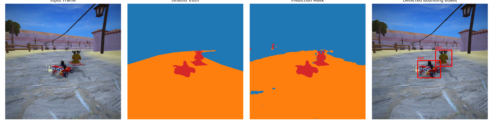
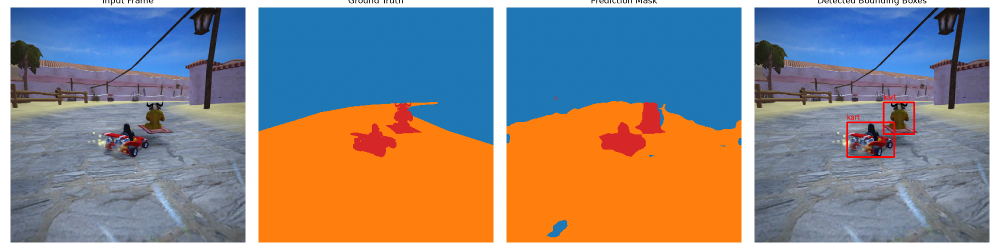
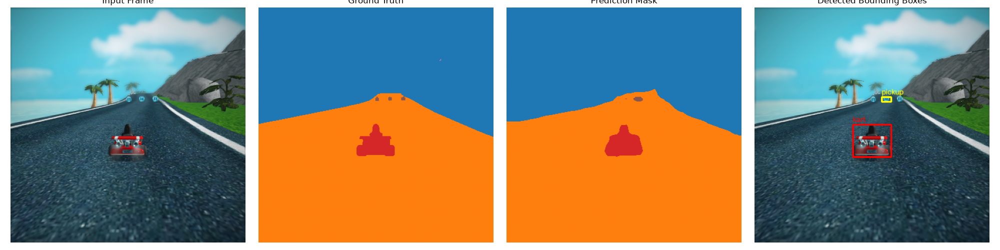

# Segmentación Semántica en SuperTuxKart: SAM 2 vs. YOLO

> [!IMPORTANT]
> Reporte Slop: **[https://martin76ec.github.io/sam-vs-yolo/](https://martin76ec.github.io/sam-vs-yolo/)**

---

## 1. Hallazgos en el Dataset

1. **Desbalance de clases:**
   - **Fondo (Clase 0):** 51.2% de los píxeles.
   - **Pista (Clase 1):** 46.4% de los píxeles.
   - Pista y Fondo cubren más del **97.6%** de la escena, mientras que objetos críticos como **Nitro (0.02%)**, **Bomba (0.04%)** y **Proyectil (0.01%)** son extremadamente escasos.
   - Se aplicó una ponderación suavizada por frecuencias $((N / (N_c + 1000))^{0.25})$ en `CrossEntropyLoss` para evitar que el modelo colapsara prediciendo únicamente pista y fondo.

---

## 2. Comparativa de Resultados

### Desglose de IoU por Clase

| Clase | SAM 2.1 IoU | YOLOv8n IoU | Observaciones |
| :--- | :--- | :--- | :--- |
| **Fondo** | **0.9128** | 0.8692 | SAM 2 delimita mejor el horizonte y siluetas complejas |
| **Pista** | **0.9087** | 0.8688 | Ambos modelos capturan la superficie de carrera con alta fidelidad |
| **Kart** | **0.9098** | 0.8277 | SAM 2 mantiene contornos nítidos de ruedas y chasis |
| **Pickup** | **0.6466** | 0.4961 | SAM 2 detecta cajas de regalo lejanas con mayor precisión |
| **Nitro** | **0.5453** | 0.3930 | Botellas pequeñas segmentadas correctamente en primer plano |
| **Bomba** | **0.4115** | 0.3279 | Obstáculos esféricos identificados sin falsos positivos |
| **Proyectil** | 0.0081 | **0.1525** | Clase con presencia casi nula en el dataset (<30k píxeles) |

---

## 3. Outputs 

### SAM 2.1 Tiny



### YOLOv8n



---

## 4. Comandos de Ejecución

```bash
# SAM
make train        
make eval        
make live         

# YOLO
make yolo-train   
make yolo-eval    
make yolo-live    
```
